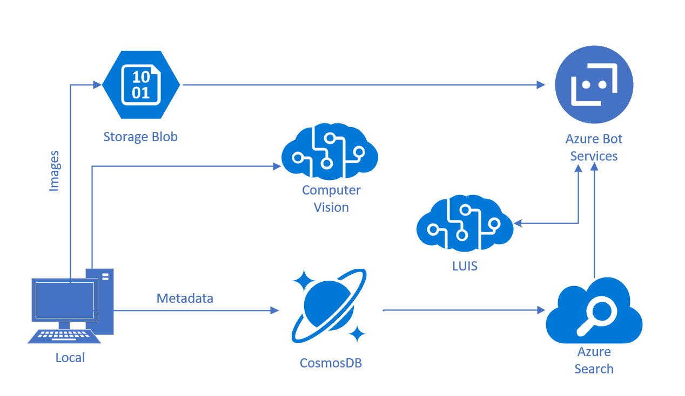

# Architecture

## Deployment
At the bottom of PictureBot.cs, you need to add your Azure Search service name, key, and index name.

Near the bottom of Startup.cs, you need to add your LUIS App ID, Subscription key, and endpoint (e.g. https://westus.api.cognitive.microsoft.com/).

az login
az account list
az account set --subscription "-- your subscription id --"

msbot connect luis --name "PictureBot" --appId "your LUIS app id" --version 0.1 --authoringKey "your authoring key" --subscriptionKey "your authoring key" --secret "-- your Bot File Secret --"

// If you need to update the LUIS model
msbot update luis --name "PictureBot" --appId "your LUIS app id" --version 0.1 --authoringKey "your authoring key" --subscriptionKey "your authoring key" --secret "-- your Bot File Secret --"

## Generate the NEW_LUIS_MODEL cs Class and add it in our project
msbot get pic --bot "BotConfiguration.bot" --secret "-- your Bot File Secret --" | luis export version --stdin > luispicture.json
luisgen luispicture.json -cs LUISPicture -o Models

